# 🌳 Grove

[](https://github.com/Vyntral/Grove/actions/workflows/ci.yml)
[](https://github.com/Vyntral/Grove/actions/workflows/ci-live.yml)
[](./LICENSE)
[](https://bun.sh)
[](https://www.npmjs.com/package/@vyntral/grove-core)
[](https://vyntral.github.io/Grove)
[](./CHANGELOG.md)

> **Production-grade AI agents.** OTP-style supervision, compile-time optimization, live time-travel inspection, behaviour diff. Built for engineers who need agents that don't fall over in prod.

<p align="center">
  
</p>

```bash
bun add @vyntral/grove-core @vyntral/grove-runtime
```

---

## Why Grove

96% of organizations are running AI agents. Only 1 in 9 has them in production at scale.

The problem isn't the models. It's that today's agent frameworks were built as scripts: brittle, opaque, expensive, and impossible to debug once they're live. Most failures originate at the **boundaries** between processes — exactly where current tooling has nothing to say.

Grove takes the lessons from 30 years of Erlang/OTP fault tolerance, adds a workflow compiler, and wraps both in a developer experience that feels like Next.js. It is the runtime layer agents have been missing.

## The three superpowers

### 1. Supervised processes, not scripts

Define your agent topology. The runtime spawns each agent as a supervised process. When something crashes — and it will — the supervisor restarts it under your declared strategy (`one_for_one`, `one_for_all`, or `rest_for_one`), with crash-loop guards. Let it crash; let the system heal.

```ts
import { agent, supervise, tool } from '@vyntral/grove-core'
import { start } from '@vyntral/grove-runtime'

const research = agent({
  name: 'research',
  model: 'anthropic/claude-opus-4-7',
  tools: [search, summarize],
})

const tree = supervise({
  strategy: 'rest_for_one',
  children: [research, writer],
  restart: { intensity: 5, period: 60_000 },
})

const { handle } = await start(tree)
await handle.run({ topic: 'sparse attention' })
```

### 2. Compile-to-determinism + runtime cache

Most agent workflows have stable, deterministic paths — formatting, parsing, lookups, cached responses. Grove's compiler analyzes your topology, identifies which steps don't actually need an LLM, and projects the cost reduction. The runtime cache then makes the projection real: deterministic tool calls hit a SQLite-backed cache before invoking the model.

<p align="center">
  
</p>

```bash
$ grove compile examples/research.ts
  total cost projection: $0.1440 → $0.0144 (10.0× cheaper)

$ bun packages/examples/src/persist.ts        # first run
run: 599ms
cache: { entries: 1, hits: 0, misses: 1, hitRate: 0 }

$ bun packages/examples/src/persist.ts        # second run (cached)
run: 99ms
cache: { entries: 1, hits: 1, misses: 0, hitRate: 1 }
```

<p align="center">
  
</p>

The cache survives across processes — restart your dev server, redeploy your worker, the warm cache stays warm.

### 3. The Bench — live time-travel inspector

Every run is recorded automatically. Open the Bench (`grove bench`) and watch your agents execute in real time, scrub through any past session, click any step to see its inputs/outputs/cost, and see cache hits / saved $ live.

```bash
$ grove bench
✓ bench listening on http://localhost:4773
```

### 4. Hot reload, only what changed

Edit `agent.ts`, save, and only the children whose definitions actually changed restart. Siblings keep running, sessions keep their state.

```bash
$ grove run --watch agent.ts
✓ started agent.ts
  watching for changes — Ctrl+C to stop
→ hot-reloaded: research
```

### 5. Behaviour diff — catch regressions before merge

Declare eval cases, save a profile, diff across runs. CI exits non-zero on regression.

```ts
import { suite, evalCase, contains } from '@vyntral/grove-eval'

export const suite = suite('word-counter', [
  evalCase({
    id: 'short',
    input: 'How many words: "hello world"?',
    assertions: [contains('2')],
  }),
])
```

```bash
$ grove eval examples/eval-suite.ts
word-counter: 4 passed, 0 failed in 7569ms
  ✓ short                1772ms
  ✓ medium               1644ms
  ...

$ grove diff word-counter
  drift: 1
  regressed: 1
    regressed   short  — output does not contain "2"
```

### 6. Anthropic prompt caching, auto-on

Long system prompts are cached at the model layer for `anthropic/*` models — Grove writes the `cache_control: ephemeral` breakpoint for you. 90% input-token discount on cache reads, surfaced as `prompt_cache` events.

### 7. MCP-native — any tool from any MCP server, plug-and-play

```ts
import { mcpServer } from '@vyntral/grove-mcp'

const fs = await mcpServer({
  command: 'npx',
  args: ['-y', '@modelcontextprotocol/server-filesystem', process.cwd()],
})

const a = agent({
  name: 'librarian',
  model: 'anthropic/claude-haiku-4-5',
  tools: fs.tools, // MCP tools surface as Grove tools, with prefix
})
```

Spawned as real stdio child processes. Tool calls flow through Grove's recorder + cache transparently.

---

## Install

```bash
# Bun (recommended)
curl -fsSL https://bun.sh/install | bash

# Then in your project:
bun add @vyntral/grove-core @vyntral/grove-runtime @vyntral/grove-compiler @vyntral/grove-cli
```

> Grove targets Bun 1.3+ for native SQLite + native TypeScript. Node support tracked in [#node-support](https://github.com/Vyntral/Grove/issues).

## Quickstart

```bash
$ grove init agent.ts
✓ created agent.ts
  run it with: grove run agent.ts

$ grove run agent.ts
→ running agent.ts
hello, world 🌳
✓ done in 102ms
  session: s_1778016019099_k8lnf5
  inspect: grove inspect s_1778016019099_k8lnf5
```

## How it differs

|  | LangChain / CrewAI | DSPy / TextGrad | Replay / AgentOps | **Grove** |
|---|---|---|---|---|
| Supervised processes | – | – | – | ✅ |
| Restart strategies | – | – | – | ✅ |
| Compile-time optimization | – | prompt-only | – | workflow-level |
| Runtime cache | – | – | – | ✅ persistent |
| Hot reload (per-child) | – | – | – | ✅ |
| Time-travel debug | – | – | ✅ | ✅ + fork |
| Recorder DB built-in | – | – | – | ✅ |
| Zero-config local UI | – | – | – | ✅ (Bench) |
| MCP-native | partial | – | – | ✅ stdio adapter |
| One install | partial | – | – | ✅ |

## Backends

Grove ships with a **mock backend** so you can run all examples (and demo the runtime) without API keys. To talk to a real frontier model, plug in the AI SDK backend:

```bash
# Option 1 — Vercel AI Gateway (recommended; one key, any provider)
export AI_GATEWAY_API_KEY=sk_gateway_xxx
bun packages/examples/src/smoke-llm.ts

# Option 2 — direct provider (Anthropic only at the moment)
export ANTHROPIC_API_KEY=sk-ant-xxx
export GROVE_DIRECT_PROVIDER=1
bun packages/examples/src/smoke-llm.ts
```

The AI SDK backend addresses models with the canonical `provider/model` syntax and works with any provider on the Gateway:

- `anthropic/claude-opus-4-7`
- `openai/gpt-5.5`
- `google/gemini-3.1-pro`
- `subq/subq-1m-preview`
- … and any other AI Gateway-compatible model.

## Tests

Two suites:

```bash
# Unit + integration against MockBackend — fast, no API key needed.
bun run test                    # 37 tests, ~1.5s

# Real LLM integration against Anthropic — ~15s, costs a few cents.
ANTHROPIC_API_KEY=sk-... GROVE_DIRECT_PROVIDER=1 bun run test:live   # 6 tests
```

The live suite covers AISDK roundtrip, typed tool calling, deterministic
cache hits, Anthropic prompt caching (`cache_read > 0` on the second call),
streaming chunk emission, and MCP stdio end-to-end. Skipped automatically
when the env var is missing, so contributors don't need a key. CI runs the
unit suite on every push and the live suite daily + on manual dispatch.

## Architecture

See [docs/architecture.md](./docs/architecture.md) for the runtime model, [docs/spec.md](./docs/spec.md) for the API spec, and [docs/manifesto.md](./docs/manifesto.md) for the design philosophy.

## License

MIT © Grove contributors
